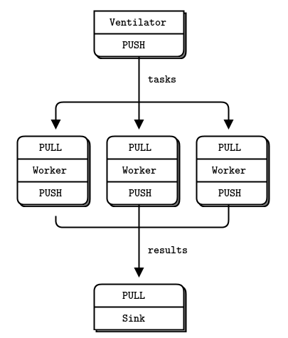
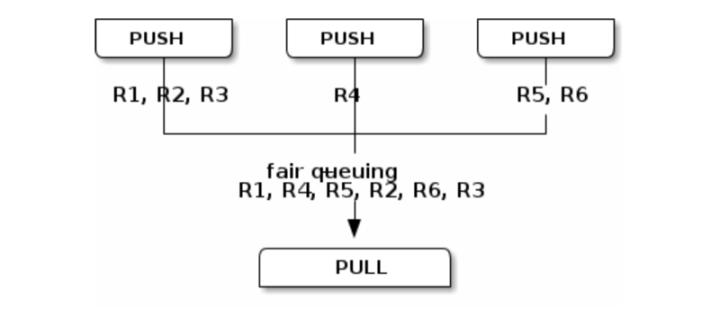
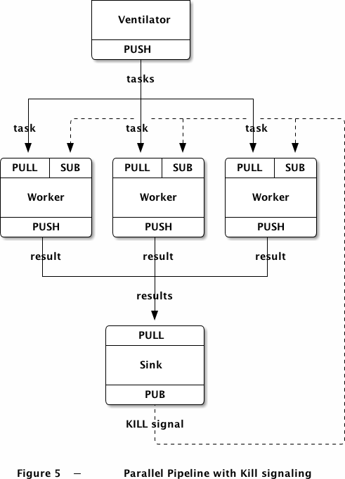

# PUSH-PULL 模式

  
  

---

* Push端与pull端都可以绑定，如果在 Push 端绑定地址，这是一个 Push server Pull clients 可以 connect 到这个 Push server 往外拉数据；反之，如果建立一个 Pull server，对应的 Push clients 可以 connect 到这个 Pull server 往里压数据
* 数据会缓存，保证不丢失，即push端未有对应的pull与之连接，或发生断开，重连后，数据会接着上次的继续发送
* 与发布订阅不同，多个pull会轮流拉取任务，而不是全部都拉相同的任务。
* 对于具体的连接，传输时单向的