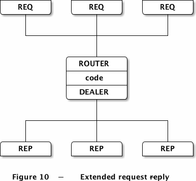

# ROUTER-DEALER 模式

  

---

* 内置代理 zmq_device (ZMQ_QUEUE, frontend, backend)
* 主要用于扩容REQ-REP模式
* ROUTER是ZMQ中唯一一个可以定位消息来源的套接字。
* Client 和 Server 都无需知道对方，只需要知道 Broder即可，由Broker进行分发请求和应答，内部会负载均衡
* 从ROUTER中读取一条消息时，ØMQ会包上一层信封，上面注明了消息的来源。
* 向ROUTER写入一条消息时（包含信封），ØMQ会将信封拆开，并将消息递送给相应的对象。
 
* DEALER是一种负载均衡，它会将消息分发给已连接的节点，并使用公平队列的机制处理接受到的消息。DEALER的作用就像是PUSH和PULL的结合。

* REQ发送消息时会在消息顶部插入一个空帧，接受时会将空帧移去。其实REQ是建立在DEALER之上的，但REQ只有当消息发送并接受到回应后才能继续运行。

* ROUTER在收到消息时会在顶部添加一个信封，标记消息来源。发送时会通过该信封决定哪个节点可以获取到该条消息。

* REP在收到消息时会将第一个空帧之前的所有信息保存起来，将原始信息传送给应用程序。在发送消息时，REP会用刚才保存的信息包裹应答消息。REP其实是建立在ROUTER之上的，但和REQ一样，必须完成接受和发送这两个动作后才能继续。